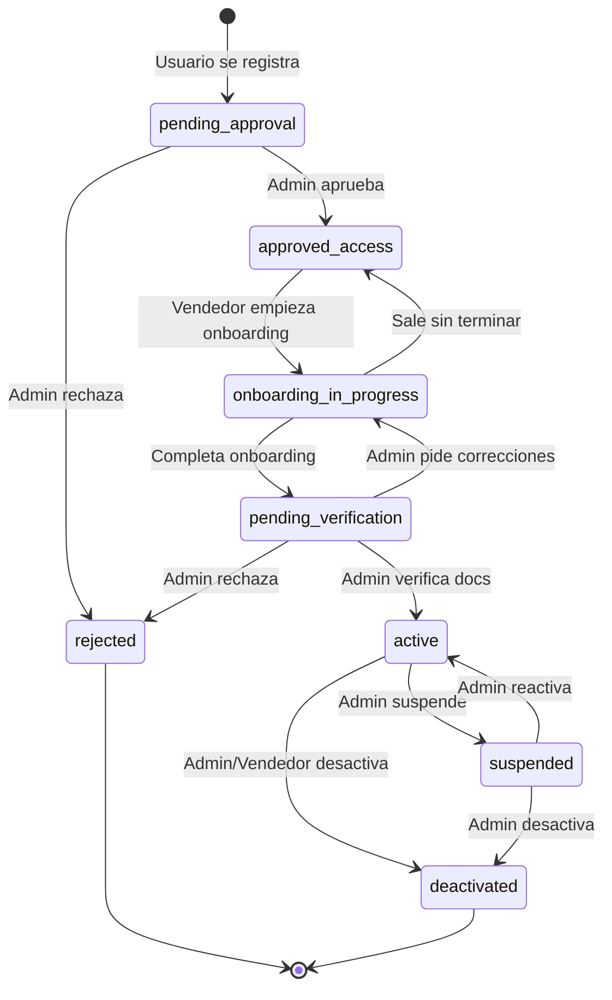

# 🔄 Flujo Completo de Alta de Vendedor - Origen

## 📋 Índice

1. [Visión General](#visión-general)
2. [Estados del Vendedor](#estados-del-vendedor)
3. [Flujo Paso a Paso](#flujo-paso-a-paso)
4. [Diagramas](#diagramas)
5. [Componentes UI](#componentes-ui)
6. [API Endpoints](#api-endpoints)
7. [Base de Datos](#base-de-datos)
8. [Notificaciones](#notificaciones)

---

## Visión General

El proceso de alta tiene **2 aprobaciones del administrador**:

1. **Primera aprobación**: Filtro inicial básico → Permite login
2. **Segunda aprobación**: Verificación de documentación legal → Permite vender

### Principios del Diseño

✅ **Baja fricción inicial** - Solo datos esenciales en registro
✅ **Inversión progresiva** - El vendedor solo invierte tiempo si pasa filtro inicial
✅ **Control de calidad en 2 fases** - Filtro rápido + verificación detallada
✅ **Trabajo anticipado** - Puede preparar catálogo mientras espera aprobación
✅ **Transparencia** - Estado claro en cada momento

---

## Estados del Vendedor

```typescript
type SellerStatus = 
  | 'pending_approval'        // 1️⃣ Registrado, esperando 1ª aprobación admin
  | 'rejected'                // ❌ Rechazado por admin
  | 'approved_access'         // 2️⃣ Aprobado para login, debe completar onboarding
  | 'onboarding_in_progress'  // 3️⃣ Completando información del onboarding
  | 'pending_verification'    // 4️⃣ Onboarding completo, esperando 2ª aprobación
  | 'active'                  // ✅ Verificado, puede vender (productos públicos)
  | 'suspended'               // ⏸️ Suspendido temporalmente
  | 'deactivated';            // 🔒 Desactivado permanentemente
```

### Matriz de Permisos

| Estado | Login | Ver Dashboard | Editar Perfil | Crear Productos | Productos Públicos | Recibir Ventas |
|--------|-------|---------------|---------------|-----------------|--------------------|-----------------| 
| `pending_approval` | ❌ | ❌ | ❌ | ❌ | ❌ | ❌ |
| `rejected` | ❌ | ❌ | ❌ | ❌ | ❌ | ❌ |
| `approved_access` | ✅ | ✅ (limitado) | ✅ (onboarding) | ❌ | ❌ | ❌ |
| `onboarding_in_progress` | ✅ | ✅ (limitado) | ✅ (onboarding) | ❌ | ❌ | ❌ |
| `pending_verification` | ✅ | ✅ | ✅ | ✅ | ❌ (draft) | ❌ |
| `active` | ✅ | ✅ | ✅ | ✅ | ✅ | ✅ |
| `suspended` | ✅ | ✅ (solo lectura) | ❌ | ❌ | ❌ (ocultos) | ❌ |
| `deactivated` | ❌ | ❌ | ❌ | ❌ | ❌ | ❌ |

---

## Flujo Paso a Paso

### 🟢 FASE 1: Registro Inicial (Usuario Público)

**Formulario Simplificado** (2-3 minutos)

```typescript
interface InitialRegistration {
  // Información Personal
  contactName: string;
  contactSurname: string;
  email: string;
  phone: string;
  
  // Información Básica del Negocio
  businessName: string;
  businessType: 'individual' | 'company'; // Autónomo o Empresa
  
  // Ubicación Básica
  province: string;
  city: string;
  
  // Categoría
  producerCategory: ProducerCategory;
  
  // Motivación (textarea corto)
  whyOrigin: string; // Max 300 caracteres
  
  // Legal
  acceptsTerms: boolean;
  acceptsPrivacy: boolean;
}
```

**Validaciones mínimas:**
- Email único
- Teléfono español válido
- Acepta términos y privacidad

**Resultado:**
```typescript
{
  status: 'pending_approval',
  message: 'Tu solicitud ha sido enviada. Te notificaremos en 24-48h.'
}
```

---

### 🔵 FASE 2: Primera Aprobación del Admin

**Panel de Administración - Vista de Solicitudes**

El admin ve:
```typescript
interface PendingSeller {
  id: string;
  businessName: string;
  contactName: string;
  email: string;
  phone: string;
  province: string;
  city: string;
  producerCategory: string;
  whyOrigin: string;
  submittedAt: Date;
}
```

**Acciones del Admin:**

1. **Aprobar** → 
   - Estado: `approved_access`
   - Se crea usuario en sistema auth (con password temporal)
   - Se envía email con credenciales de acceso
   - Se crea registro en tabla `sellers`

2. **Rechazar** →
   - Estado: `rejected`
   - Se pide motivo del rechazo
   - Se envía email notificando con motivo

3. **Solicitar más información** →
   - Email al vendedor pidiendo aclaraciones
   - Estado sigue en `pending_approval`

**Email de aprobación:**
```
Asunto: ¡Bienvenido a Origen! 🌱

Hola [Nombre],

¡Nos encanta que quieras formar parte de Origen!

Tu solicitud ha sido aprobada. Ya puedes acceder a tu panel de vendedor:

🔗 https://panel.origen.es/login

📧 Email: tu-email@ejemplo.com
🔑 Contraseña temporal: XXXX-XXXX-XXXX

Por seguridad, te pediremos cambiar la contraseña en tu primer acceso.

Próximos pasos:
1. Accede al panel
2. Completa tu perfil y documentación
3. Espera la verificación final (24-48h)
4. ¡Empieza a vender!

---
Equipo Origen
```

---

### 🟡 FASE 3: Onboarding del Vendedor (Post-Login)

**Primera vez que el vendedor hace login:**

```
┌─────────────────────────────────────────┐
│  👋 ¡Bienvenido a Origen!               │
│                                         │
│  Completa tu perfil para empezar       │
│  a vender. Esto tomará unos 15-20 min. │
│                                         │
│  Podrás editar esta información        │
│  después desde Configuración.          │
│                                         │
│      [Empezar Onboarding] [Más tarde]  │
└─────────────────────────────────────────┘
```

**Si elige "Más tarde":**
- Puede explorar el dashboard (limitado)
- Banner persistente recordando completar perfil
- No puede crear productos hasta completar

**Pasos del Onboarding:**

#### Paso 1/6: Ubicación Completa
```typescript
{
  street: string;
  number: string;
  postalCode: string;
  city: string; // Ya tiene, pero editable
  province: string; // Ya tiene
  autonomousCommunity: string;
  
  // ⭐ CLAVE: Región Turística
  touristicRegion: {
    id: string;
    name: string;
    description: string;
  }
}
```

#### Paso 2/6: Historia y Valores
```typescript
{
  businessStory: string; // Min 200 caracteres
  philosophy: string;
  sustainabilityPractices: string[];
  
  // Certificaciones (marcar si aplica)
  hasOrganicCertification: boolean;
  hasDopIgpCertification: boolean;
  certificationDetails?: string;
}
```

#### Paso 3/6: Perfil Visual
```typescript
{
  banner: File; // 1200x400px, max 2MB
  logo?: File; // 400x400px, max 1MB
  gallery?: File[]; // Max 5 imágenes
}
```

#### Paso 4/6: Capacidad y Entregas
```typescript
{
  monthlyCapacity: number;
  capacityUnit: 'kg' | 'litros' | 'unidades';
  
  deliveryRadius: number; // km
  availableDeliveryDays: DayOfWeek[];
  
  // Horarios de producción/entrega (opcional)
  workingHours?: string;
}
```

#### Paso 5/6: Documentación Legal ⚠️ CRÍTICO
```typescript
{
  documents: Array<{
    type: DocumentType;
    file: File; // PDF, JPG, PNG - Max 10MB
    expirationDate?: Date; // Si aplica
  }>;
  
  // Mínimo requerido:
  // - CIF/NIF/NIE
  // - RGSEAA
  // - IAE
  // - Seguro RC
  // - Manipulador Alimentos
  // - APPCC
  // - Licencia Actividad
}
```

**Validación:**
- Al menos 7 documentos obligatorios
- Formatos válidos
- Tamaño < 10MB por archivo

#### Paso 6/6: Cuenta Stripe Connect 💳

**Flujo:**

1. Sistema crea cuenta Stripe Express:
```typescript
const account = await stripe.accounts.create({
  type: 'express',
  country: 'ES',
  email: seller.email,
  business_profile: {
    name: seller.businessName,
    product_description: seller.businessStory,
  },
  metadata: {
    sellerId: seller.id,
  },
});
```

2. Sistema genera Account Link:
```typescript
const accountLink = await stripe.accountLinks.create({
  account: account.id,
  refresh_url: 'https://panel.origen.es/onboarding/stripe/refresh',
  return_url: 'https://panel.origen.es/onboarding/stripe/complete',
  type: 'account_onboarding',
});
```

3. Se abre en ventana:
```jsx
<div className="text-center">
  <h3>Configurar Cuenta de Pagos</h3>
  <p>
    Stripe procesará tus pagos de forma segura.
    Necesitarás:
  </p>
  <ul>
    <li>✓ Número de cuenta bancaria (IBAN)</li>
    <li>✓ DNI/NIE (para verificación)</li>
    <li>✓ Información fiscal</li>
  </ul>
  <Button onClick={() => window.location.href = accountLink.url}>
    Continuar a Stripe
  </Button>
</div>
```

4. Vendedor completa en Stripe (~5 min)
5. Stripe redirige a `return_url`
6. Sistema verifica estado de cuenta

**Al finalizar onboarding:**
```typescript
{
  status: 'pending_verification',
  message: 'Perfil completado. Estamos revisando tu documentación...'
}
```

---

### 🟣 FASE 4: Verificación de Documentación (Admin)

**Panel Admin - Vendedores Pendientes de Verificación**

El admin ve perfil completo del vendedor:

```typescript
interface SellerForVerification {
  // Información completa
  profile: SellerProfile;
  
  // Documentos para revisar
  documents: Array<{
    id: string;
    type: DocumentType;
    fileName: string;
    fileUrl: string;
    uploadedAt: Date;
    status: 'pending_review';
  }>;
  
  // Stripe
  stripeAccount: {
    id: string;
    chargesEnabled: boolean;
    payoutsEnabled: boolean;
    detailsSubmitted: boolean;
  };
  
  // Timeline
  registeredAt: Date;
  approvedForAccessAt: Date;
  onboardingCompletedAt: Date;
}
```

**Acciones del Admin:**

1. **Revisar cada documento:**
   ```jsx
   <DocumentReview
     document={doc}
     onApprove={() => updateDoc(doc.id, 'approved')}
     onReject={(reason) => updateDoc(doc.id, 'rejected', reason)}
   />
   ```

2. **Decisión final:**

   **Opción A: Aprobar** →
   ```typescript
   {
     status: 'active',
     activatedAt: new Date(),
     canPublishProducts: true,
     canReceivePayments: true
   }
   ```
   
   **Email:**
   ```
   ¡Tu cuenta está activa! 🎉
   
   Ya puedes:
   ✓ Publicar productos
   ✓ Recibir pedidos
   ✓ Cobrar ventas
   
   Tu perfil público: https://origen.es/vendedor/tu-slug
   ```

   **Opción B: Solicitar correcciones** →
   ```typescript
   {
     status: 'onboarding_in_progress', // Vuelve atrás
     verificationNotes: [
       {
         documentId: 'xxx',
         issue: 'RGSEAA ilegible, por favor vuelve a subir'
       }
     ]
   }
   ```
   
   **Opción C: Rechazar** →
   ```typescript
   {
     status: 'rejected',
     rejectionReason: 'La documentación no cumple requisitos...'
   }
   ```

---

### 🟢 FASE 5: Vendedor Activo

**Estado: `active`**

**Permisos:**
- ✅ Crear/editar productos
- ✅ Productos se publican automáticamente
- ✅ Gestionar inventario
- ✅ Procesar pedidos
- ✅ Recibir pagos vía Stripe
- ✅ Ver dashboard completo
- ✅ Crear promociones
- ✅ Editar perfil desde Configuración

**Dashboard completo disponible:**
```
┌─────────────────────────────────────┐
│ Dashboard Principal                 │
├─────────────────────────────────────┤
│ • Resumen de Ventas                │
│ • Pedidos Pendientes               │
│ • Productos Activos                │
│ • Ingresos del Mes                 │
└─────────────────────────────────────┘

┌─────────────────────────────────────┐
│ Productos                           │
├─────────────────────────────────────┤
│ [+ Nuevo Producto]                 │
│                                     │
│ Lista de productos con estado:     │
│ • Publicado ✅                      │
│ • Borrador 📝                       │
│ • Sin stock ⚠️                      │
└─────────────────────────────────────┘

┌─────────────────────────────────────┐
│ Configuración                       │
├─────────────────────────────────────┤
│ • Perfil del Negocio               │
│ • Documentación Legal              │
│ • Cuenta Stripe                    │
│ • Notificaciones                   │
│ • Contraseña y Seguridad           │
└─────────────────────────────────────┘
```

---

## Diagramas

### Diagrama de Estados



### Flujo Visual Completo

```
┌─────────────────┐
│   USUARIO WEB   │
└────────┬────────┘
         │
         │ 1. Registro simple
         ▼
┌─────────────────────────────┐
│  pending_approval           │
│  Espera revisión admin      │
└────────┬────────────────────┘
         │
         │ 2. Admin aprueba
         ▼
┌─────────────────────────────┐
│  approved_access            │
│  ✉️ Email: "Puedes entrar!" │
└────────┬────────────────────┘
         │
         │ 3. Login + Onboarding
         ▼
┌─────────────────────────────┐
│  onboarding_in_progress     │
│  Completa 6 pasos           │
│  • Ubicación                │
│  • Historia                 │
│  • Visual                   │
│  • Capacidad                │
│  • Documentos ⚠️            │
│  • Stripe 💳                │
└────────┬────────────────────┘
         │
         │ 4. Envía todo
         ▼
┌─────────────────────────────┐
│  pending_verification       │
│  Admin revisa documentos    │
│  Puede trabajar catálogo    │
│  (productos en draft)       │
└────────┬────────────────────┘
         │
         │ 5. Admin verifica
         ▼
┌─────────────────────────────┐
│  active ✅                   │
│  Productos se publican      │
│  Puede recibir ventas       │
└─────────────────────────────┘
```

---

## Componentes UI

### 1. Formulario de Registro Inicial

```tsx
// components/registration/SimpleRegistration.tsx
'use client';

export function SimpleRegistration() {
  return (
    <div className="max-w-md mx-auto p-6">
      <h1 className="text-3xl font-bold text-origen-bosque mb-6">
        Vende en Origen
      </h1>
      
      <form className="space-y-4">
        {/* Datos personales */}
        <Input name="contactName" label="Nombre" />
        <Input name="contactSurname" label="Apellidos" />
        <Input name="email" type="email" label="Email" />
        <Input name="phone" type="tel" label="Teléfono" />
        
        {/* Negocio */}
        <Input name="businessName" label="Nombre del Negocio" />
        <Select name="businessType" label="Tipo">
          <option value="individual">Autónomo</option>
          <option value="company">Empresa</option>
        </Select>
        
        {/* Ubicación */}
        <Select name="province" label="Provincia">
          {/* Provincias españolas */}
        </Select>
        <Input name="city" label="Ciudad" />
        
        {/* Categoría */}
        <CategorySelector name="producerCategory" />
        
        {/* Motivación */}
        <Textarea 
          name="whyOrigin" 
          label="¿Por qué quieres vender en Origen?"
          maxLength={300}
          rows={4}
        />
        
        {/* Legal */}
        <Checkbox name="acceptsTerms">
          Acepto los términos y condiciones
        </Checkbox>
        <Checkbox name="acceptsPrivacy">
          Acepto la política de privacidad
        </Checkbox>
        
        <Button type="submit" className="w-full">
          Enviar Solicitud
        </Button>
      </form>
      
      <p className="text-sm text-gray-500 mt-4 text-center">
        Te responderemos en 24-48 horas
      </p>
    </div>
  );
}
```

### 2. Banner de Estado (Para vendedores no activos)

```tsx
// components/dashboard/StatusBanner.tsx
'use client';

export function StatusBanner({ status }: { status: SellerStatus }) {
  const config = {
    approved_access: {
      color: 'bg-blue-100 border-blue-500',
      icon: '👋',
      title: '¡Bienvenido!',
      message: 'Completa tu perfil para empezar a vender',
      action: { label: 'Completar Ahora', href: '/onboarding' }
    },
    onboarding_in_progress: {
      color: 'bg-yellow-100 border-yellow-500',
      icon: '📝',
      title: 'Perfil Incompleto',
      message: 'Termina de completar tu información',
      action: { label: 'Continuar', href: '/onboarding' }
    },
    pending_verification: {
      color: 'bg-orange-100 border-orange-500',
      icon: '⏳',
      title: 'Verificando Documentación',
      message: 'Estamos revisando tus documentos. Puedes preparar tu catálogo mientras tanto.',
      action: null
    },
    suspended: {
      color: 'bg-red-100 border-red-500',
      icon: '⚠️',
      title: 'Cuenta Suspendida',
      message: 'Contacta con soporte para más información',
      action: { label: 'Contactar', href: '/contacto' }
    }
  };
  
  if (status === 'active') return null;
  
  const { color, icon, title, message, action } = config[status] || {};
  
  return (
    <div className={`${color} border-l-4 p-4 mb-6 rounded`}>
      <div className="flex items-start gap-3">
        <span className="text-2xl">{icon}</span>
        <div className="flex-1">
          <h3 className="font-bold mb-1">{title}</h3>
          <p className="text-sm">{message}</p>
          {action && (
            <Button size="sm" className="mt-2">
              {action.label}
            </Button>
          )}
        </div>
      </div>
    </div>
  );
}
```

### 3. Panel Admin - Lista de Solicitudes

```tsx
// components/admin/PendingApprovals.tsx
'use client';

export function PendingApprovals({ sellers }: { sellers: PendingSeller[] }) {
  return (
    <div className="space-y-4">
      <h2 className="text-2xl font-bold">Solicitudes Pendientes</h2>
      
      {sellers.map(seller => (
        <div key={seller.id} className="bg-white p-6 rounded-lg shadow">
          <div className="flex justify-between items-start mb-4">
            <div>
              <h3 className="text-xl font-bold text-origen-bosque">
                {seller.businessName}
              </h3>
              <p className="text-sm text-gray-600">
                {seller.contactName} • {seller.email}
              </p>
            </div>
            <span className="text-xs text-gray-500">
              {formatDistanceToNow(seller.submittedAt, { locale: es })}
            </span>
          </div>
          
          <div className="grid grid-cols-2 gap-4 mb-4">
            <div>
              <span className="text-xs text-gray-500">Ubicación</span>
              <p className="text-sm">{seller.city}, {seller.province}</p>
            </div>
            <div>
              <span className="text-xs text-gray-500">Categoría</span>
              <p className="text-sm">{seller.producerCategory}</p>
            </div>
          </div>
          
          <div className="mb-4">
            <span className="text-xs text-gray-500">Motivación</span>
            <p className="text-sm">{seller.whyOrigin}</p>
          </div>
          
          <div className="flex gap-2">
            <Button 
              variant="default" 
              onClick={() => handleApprove(seller.id)}
            >
              ✓ Aprobar
            </Button>
            <Button 
              variant="destructive" 
              onClick={() => handleReject(seller.id)}
            >
              ✗ Rechazar
            </Button>
            <Button 
              variant="outline"
              onClick={() => viewDetails(seller.id)}
            >
              Ver Detalles
            </Button>
          </div>
        </div>
      ))}
    </div>
  );
}
```

---

## API Endpoints

### Registro y Aprobación

```typescript
// POST /api/sellers/register
// Registro inicial público
POST /api/sellers/register
Body: InitialRegistration
Response: { id: string, status: 'pending_approval' }

// GET /api/admin/sellers/pending
// Lista de vendedores pendientes de 1ª aprobación
GET /api/admin/sellers/pending
Response: PendingSeller[]

// POST /api/admin/sellers/:id/approve
// Aprobar vendedor (1ª aprobación)
POST /api/admin/sellers/:id/approve
Response: { 
  status: 'approved_access',
  credentials: { email, temporaryPassword }
}

// POST /api/admin/sellers/:id/reject
// Rechazar vendedor
POST /api/admin/sellers/:id/reject
Body: { reason: string }
Response: { status: 'rejected' }
```

### Onboarding

```typescript
// GET /api/sellers/onboarding/status
// Estado del onboarding del vendedor actual
GET /api/sellers/onboarding/status
Response: { 
  status: SellerStatus,
  completedSteps: number,
  totalSteps: number,
  missingFields: string[]
}

// PUT /api/sellers/onboarding/step/:step
// Guardar paso del onboarding
PUT /api/sellers/onboarding/step/:step
Body: StepData
Response: { 
  saved: boolean,
  nextStep: number | null
}

// POST /api/sellers/onboarding/documents
// Subir documentos legales
POST /api/sellers/onboarding/documents
Body: FormData (multipart)
Response: { 
  documentId: string,
  status: 'pending_review'
}

// POST /api/sellers/onboarding/stripe
// Crear cuenta Stripe Connect
POST /api/sellers/onboarding/stripe
Response: { 
  accountId: string,
  onboardingUrl: string
}

// POST /api/sellers/onboarding/complete
// Finalizar onboarding
POST /api/sellers/onboarding/complete
Response: { 
  status: 'pending_verification'
}
```

### Verificación y Gestión

```typescript
// GET /api/admin/sellers/verification-queue
// Vendedores pendientes de verificación de docs
GET /api/admin/sellers/verification-queue
Response: SellerForVerification[]

// POST /api/admin/sellers/:id/documents/:docId/verify
// Aprobar/rechazar documento individual
POST /api/admin/sellers/:id/documents/:docId/verify
Body: { 
  status: 'approved' | 'rejected',
  reason?: string
}

// POST /api/admin/sellers/:id/activate
// Activar vendedor (2ª aprobación final)
POST /api/admin/sellers/:id/activate
Response: { 
  status: 'active',
  activatedAt: Date
}

// POST /api/admin/sellers/:id/request-corrections
// Pedir correcciones al vendedor
POST /api/admin/sellers/:id/request-corrections
Body: {
  corrections: Array<{
    documentId?: string,
    field?: string,
    issue: string
  }>
}

// PATCH /api/sellers/:id/suspend
// Suspender vendedor
PATCH /api/sellers/:id/suspend
Body: { reason: string }

// PATCH /api/sellers/:id/reactivate
// Reactivar vendedor suspendido
PATCH /api/sellers/:id/reactivate
```

---

## Base de Datos

### Tabla: seller_registrations (Solicitudes iniciales)

```sql
CREATE TABLE seller_registrations (
  id UUID PRIMARY KEY DEFAULT gen_random_uuid(),
  
  -- Información Personal
  contact_name VARCHAR(100) NOT NULL,
  contact_surname VARCHAR(100) NOT NULL,
  email VARCHAR(255) UNIQUE NOT NULL,
  phone VARCHAR(20) NOT NULL,
  
  -- Información Negocio
  business_name VARCHAR(200) NOT NULL,
  business_type VARCHAR(20) NOT NULL, -- 'individual' | 'company'
  
  -- Ubicación Básica
  province VARCHAR(100) NOT NULL,
  city VARCHAR(100) NOT NULL,
  
  -- Categoría
  producer_category VARCHAR(50) NOT NULL,
  
  -- Motivación
  why_origin TEXT NOT NULL,
  
  -- Legal
  accepts_terms BOOLEAN NOT NULL DEFAULT true,
  accepts_privacy BOOLEAN NOT NULL DEFAULT true,
  
  -- Estado
  status VARCHAR(50) NOT NULL DEFAULT 'pending_approval',
  submitted_at TIMESTAMPTZ DEFAULT NOW(),
  
  -- Primera Aprobación
  reviewed_at TIMESTAMPTZ,
  reviewed_by UUID, -- Admin que revisó
  rejection_reason TEXT,
  
  -- Relación con seller
  seller_id UUID, -- Se llena cuando se aprueba
  
  created_at TIMESTAMPTZ DEFAULT NOW(),
  updated_at TIMESTAMPTZ DEFAULT NOW()
);

CREATE INDEX idx_registrations_status ON seller_registrations(status);
CREATE INDEX idx_registrations_email ON seller_registrations(email);
```

### Tabla: sellers (Vendedores aprobados)

```sql
CREATE TABLE sellers (
  id UUID PRIMARY KEY DEFAULT gen_random_uuid(),
  registration_id UUID REFERENCES seller_registrations(id),
  user_id UUID NOT NULL, -- Referencia a auth.users
  
  -- Estado CRÍTICO
  status VARCHAR(50) NOT NULL DEFAULT 'approved_access',
  
  -- Información básica (copiada del registro)
  business_name VARCHAR(200) NOT NULL,
  slug VARCHAR(200) UNIQUE NOT NULL,
  contact_name VARCHAR(100),
  email VARCHAR(255) UNIQUE NOT NULL,
  phone VARCHAR(20),
  
  -- Onboarding Progress
  onboarding_completed BOOLEAN DEFAULT false,
  onboarding_completed_at TIMESTAMPTZ,
  onboarding_step_current INTEGER DEFAULT 1,
  
  -- Ubicación Completa (del onboarding)
  street VARCHAR(255),
  number VARCHAR(20),
  postal_code VARCHAR(5),
  city VARCHAR(100),
  province VARCHAR(100),
  autonomous_community VARCHAR(100),
  
  -- ⭐ Región Turística
  touristic_region_id VARCHAR(100),
  touristic_region_name VARCHAR(200),
  touristic_region_description TEXT,
  
  coordinates_lat DECIMAL(10, 8),
  coordinates_lng DECIMAL(11, 8),
  
  -- Perfil
  tagline VARCHAR(255),
  business_story TEXT,
  philosophy TEXT,
  producer_category VARCHAR(50),
  subcategories TEXT[],
  sustainability_practices TEXT[],
  
  -- Visual
  banner_url VARCHAR(500),
  logo_url VARCHAR(500),
  
  -- Capacidad
  monthly_capacity INTEGER,
  capacity_unit VARCHAR(20),
  delivery_radius INTEGER,
  available_delivery_days TEXT[],
  
  -- Certificaciones
  has_organic_certification BOOLEAN DEFAULT false,
  has_dop_igp_certification BOOLEAN DEFAULT false,
  
  -- Stripe Connect
  stripe_account_id VARCHAR(100) UNIQUE,
  stripe_account_status VARCHAR(50) DEFAULT 'not_created',
  stripe_charges_enabled BOOLEAN DEFAULT false,
  stripe_payouts_enabled BOOLEAN DEFAULT false,
  stripe_details_submitted BOOLEAN DEFAULT false,
  stripe_onboarded_at TIMESTAMPTZ,
  
  -- Verificación (2ª aprobación)
  verified_at TIMESTAMPTZ,
  verified_by UUID, -- Admin que verificó
  verification_notes TEXT,
  
  -- Métricas
  rating DECIMAL(3, 2) DEFAULT 0,
  review_count INTEGER DEFAULT 0,
  total_sales INTEGER DEFAULT 0,
  
  -- Flags
  is_active BOOLEAN DEFAULT false,
  is_featured BOOLEAN DEFAULT false,
  can_publish_products BOOLEAN DEFAULT false,
  can_receive_payments BOOLEAN DEFAULT false,
  
  -- Timestamps importantes
  approved_for_access_at TIMESTAMPTZ,
  activated_at TIMESTAMPTZ,
  suspended_at TIMESTAMPTZ,
  suspension_reason TEXT,
  
  created_at TIMESTAMPTZ DEFAULT NOW(),
  updated_at TIMESTAMPTZ DEFAULT NOW()
);

-- Índices
CREATE INDEX idx_sellers_status ON sellers(status);
CREATE INDEX idx_sellers_user_id ON sellers(user_id);
CREATE INDEX idx_sellers_slug ON sellers(slug);
CREATE INDEX idx_sellers_stripe_account ON sellers(stripe_account_id);
CREATE INDEX idx_sellers_province ON sellers(province);
CREATE INDEX idx_sellers_touristic_region ON sellers(touristic_region_id);

-- Constraint: Solo vendedores activos pueden publicar
ALTER TABLE sellers ADD CONSTRAINT check_publish_products 
  CHECK (
    (status = 'active' AND can_publish_products = true) OR 
    (status != 'active' AND can_publish_products = false)
  );
```

### Tabla: seller_documents

```sql
CREATE TABLE seller_documents (
  id UUID PRIMARY KEY DEFAULT gen_random_uuid(),
  seller_id UUID REFERENCES sellers(id) ON DELETE CASCADE,
  
  -- Tipo de documento
  document_type VARCHAR(50) NOT NULL,
  
  -- Archivo
  file_name VARCHAR(255) NOT NULL,
  file_url VARCHAR(500) NOT NULL,
  file_size INTEGER NOT NULL,
  mime_type VARCHAR(100) NOT NULL,
  
  -- Estado
  status VARCHAR(50) NOT NULL DEFAULT 'pending_review',
  
  -- Revisión
  uploaded_at TIMESTAMPTZ DEFAULT NOW(),
  reviewed_at TIMESTAMPTZ,
  reviewed_by UUID, -- Admin que revisó
  rejection_reason TEXT,
  
  -- Validez
  expiration_date DATE,
  is_expired BOOLEAN GENERATED ALWAYS AS (
    expiration_date IS NOT NULL AND expiration_date < CURRENT_DATE
  ) STORED,
  
  created_at TIMESTAMPTZ DEFAULT NOW()
);

CREATE INDEX idx_documents_seller ON seller_documents(seller_id);
CREATE INDEX idx_documents_status ON seller_documents(status);
CREATE INDEX idx_documents_type ON seller_documents(document_type);
```

### Tabla: seller_verification_history (Auditoría)

```sql
CREATE TABLE seller_verification_history (
  id UUID PRIMARY KEY DEFAULT gen_random_uuid(),
  seller_id UUID REFERENCES sellers(id),
  
  -- Cambio de estado
  previous_status VARCHAR(50),
  new_status VARCHAR(50) NOT NULL,
  
  -- Quién y cuándo
  changed_by UUID NOT NULL, -- Admin o sistema
  changed_at TIMESTAMPTZ DEFAULT NOW(),
  
  -- Detalles
  reason TEXT,
  notes TEXT,
  
  -- Documentos afectados (si aplica)
  affected_documents JSONB
);

CREATE INDEX idx_verification_history_seller ON seller_verification_history(seller_id);
CREATE INDEX idx_verification_history_date ON seller_verification_history(changed_at);
```

---

## Notificaciones

### Email Templates

#### 1. Registro Recibido
```
Para: vendedor@ejemplo.com
Asunto: Solicitud recibida - Origen

¡Gracias por tu interés en Origen!

Hemos recibido tu solicitud y la revisaremos en las próximas 24-48 horas.

Te notificaremos por email cuando tengamos una respuesta.

---
Equipo Origen
```

#### 2. Primera Aprobación
```
Para: vendedor@ejemplo.com
Asunto: ¡Solicitud aprobada! Accede a tu panel

¡Bienvenido a Origen, [Nombre]! 🌱

Tu solicitud ha sido aprobada. Accede ahora:

🔗 https://panel.origen.es/login
📧 Email: vendedor@ejemplo.com
🔑 Contraseña: [TEMP_PASSWORD]

Próximos pasos:
1. Cambia tu contraseña
2. Completa tu perfil (15-20 min)
3. Espera verificación final
4. ¡Empieza a vender!

---
Equipo Origen
```

#### 3. Onboarding Completado
```
Para: vendedor@ejemplo.com
Asunto: Perfil completado - En verificación

¡Perfecto, [Nombre]!

Hemos recibido toda tu información. Nuestro equipo 
revisará tu documentación en las próximas 24-48 horas.

Mientras tanto, puedes:
✓ Preparar tu catálogo de productos
✓ Familiarizarte con el panel
✓ Leer nuestra guía de primeros pasos

---
Equipo Origen
```

#### 4. Activación Final
```
Para: vendedor@ejemplo.com
Asunto: 🎉 ¡Tu cuenta está activa!

¡Felicidades, [Nombre]!

Tu cuenta ha sido verificada y activada. Ya puedes:

✅ Publicar productos
✅ Recibir pedidos
✅ Cobrar ventas

📍 Tu perfil público: https://origen.es/vendedor/[slug]

¿Necesitas ayuda? Consulta nuestra guía o contáctanos.

¡Bienvenido a la familia Origen! 🌱

---
Equipo Origen
```

#### 5. Correcciones Necesarias
```
Para: vendedor@ejemplo.com
Asunto: Revisión de documentación - Acción necesaria

Hola [Nombre],

Hemos revisado tu documentación y necesitamos algunas correcciones:

[Lista de correcciones específicas]

Por favor, accede a tu panel y sube los documentos actualizados:
🔗 https://panel.origen.es/documentacion

---
Equipo Origen
```

#### 6. Rechazo
```
Para: vendedor@ejemplo.com
Asunto: Solicitud no aprobada - Origen

Hola [Nombre],

Lamentamos informarte que no podemos aprobar tu 
solicitud en este momento.

Motivo: [RAZÓN ESPECÍFICA]

Si crees que es un error o quieres más información,
no dudes en contactarnos.

---
Equipo Origen
```

### Notificaciones In-App

```typescript
interface Notification {
  id: string;
  userId: string;
  type: 'status_change' | 'document_review' | 'action_required';
  title: string;
  message: string;
  actionUrl?: string;
  actionLabel?: string;
  read: boolean;
  createdAt: Date;
}

// Ejemplos:
{
  type: 'status_change',
  title: '¡Cuenta Activada!',
  message: 'Tu cuenta ha sido verificada. Ya puedes vender.',
  actionUrl: '/dashboard',
  actionLabel: 'Ir al Dashboard'
}

{
  type: 'document_review',
  title: 'Documento Rechazado',
  message: 'El documento RGSEAA necesita correcciones.',
  actionUrl: '/configuracion/documentos',
  actionLabel: 'Ver Detalles'
}

{
  type: 'action_required',
  title: 'Completa tu Perfil',
  message: 'Faltan algunos pasos para activar tu cuenta.',
  actionUrl: '/onboarding',
  actionLabel: 'Continuar'
}
```

---

## Resumen

Este flujo proporciona:

✅ **Baja fricción inicial** - Solo 2-3 minutos de registro
✅ **Control de calidad en 2 fases** - Filtro rápido + verificación detallada
✅ **Experiencia progresiva** - El vendedor invierte tiempo solo si vale la pena
✅ **Transparencia total** - Estado claro en cada momento
✅ **Trabajo anticipado** - Puede preparar catálogo mientras espera
✅ **Seguridad** - Verificación exhaustiva de documentación legal
✅ **Flexibilidad** - Todo editable después desde configuración

**Tiempo estimado del proceso completo:**
- Registro inicial: **2-3 minutos**
- Espera 1ª aprobación: **24-48 horas**
- Onboarding completo: **15-20 minutos**
- Espera verificación final: **24-48 horas**
- **Total: ~3-4 días** desde registro hasta vender

---

**Última actualización:** Febrero 2026
**Versión:** 2.0
